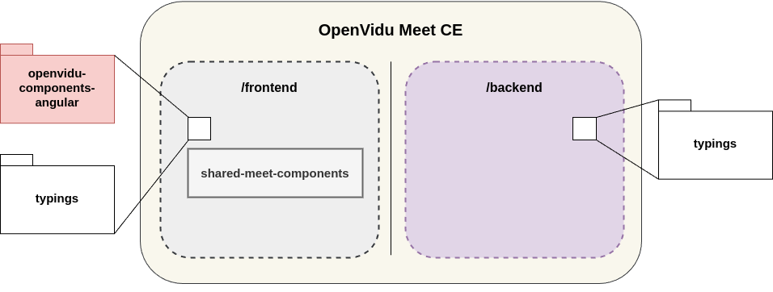

# OpenVidu Meet

# Table of Contents

1. [Architecture Overview](#architecture-overview)
2. [Development](#development)
   - [1. Clone the Repository](#1-clone-the-openvidu-meet-repository)
   - [2. Prepare the Project](#2-prepare-the-project)
   - [3. Start the Backend](#3-start-the-backend)
   - [4. Start the Frontend](#4-start-the-frontend)
3. [Testing](#testing)
4. [Build (with Docker)](#build-with-docker)
   - [Build the Backend Image](#build-the-backend-image)
   - [Run the Backend Container](#run-the-backend-container)

## Architecture Overview

The OpenVidu Meet application is composed of two main parts (frontend and backend) that interact with each other to provide the video conferencing service. The following diagram illustrates the architecture of the application:

[](/docs/openvidu-meet-ce-architecture.png)

- **Frontend**: The frontend is a web application built with Angular that provides the user interface for the video conferencing service. This project contains the **shared-meet-components** subproject, which is a library of shared components that share administration and preference components.

  Also, the frontend project installs external dependencies on the following libraries:

  - [**openvidu-components-angular**](https://github.com/OpenVidu/openvidu/tree/master/openvidu-components-angular): A library of Angular components that provide the core functionality of the video conferencing service.
  - [**typings**](./typings/): Common types used by the frontend and backend.

- **Backend**: The backend is a Node.js application.
  - [**typings**](./typings/): Common types used by the frontend and backend.

## Development

For development purposes, you can run the application locally by following the instructions below.

**1. Clone the OpenVidu Meet repository:**

```bash
git clone https://github.com/OpenVidu/openvidu-meet.git
```

**2. Prepare the project**

For building types and install dependencies, run the following command:

```bash
cd openvidu-meet
./prepare.sh
```

**3. Start the Backend**

> [!NOTE]
> For development purposes, the backend application uses the `backend/.env.development` file to load environment variables. You can customize the values in this file to suit your local development environment.

```bash
cd backend && \
npm run start:dev
```

> [!NOTE]
> **The types under `typings` are shared between the frontend and backend projects.**
> If you need to update the comon types, remember doing it in the `typings` project.
>
> Every time you make changes to the types, the backend process will automatically invoke the syncing task to update the types in the frontend and backend projects. So, you don't need to worry about updating the types manually.

**4. Start the Frontend**

Opening a new tab, under root directory:

```bash
cd frontend && \
npm run build:dev
```

This command will build the frontend application and move the files to the backend project. It will also listen for changes in the frontend application and rebuild the application when changes are detected.

After running these commands, you can access the frontend application at [http://localhost:6080](http://localhost:6080).

## Testing

This repository offers a testing application that allows you to test the OpenVidu Meet.

### Pre-requisites

To run the testing application, you need to have the following pre-requisites installed:

- [Node.js](https://nodejs.org/en/download/) (version 22 or higher)
- LiveKit CLI installed and configured.

```bash
curl -sSL https://get.livekit.io/cli | bash
```

To run the testing application, follow these steps under the root directory:

1. Install the dependencies:

```bash
cd testapp && \
npm install
```

2. Start the testing application:

```bash
npm run start
```

After running these commands, you can access the testing application at [http://localhost:5080](http://localhost:5080).

## Build (with docker)

### Build the backend image

```bash
cd docker
./create_image.sh openvidu-meet-ce
```

### Run the backend container

Once the image is created, you can run the container with the following command:

```bash
docker run \
  -e LIVEKIT_URL=<your-livekit-url> \
  -e LIVEKIT_API_KEY=<your-livekit-api-key> \
  -e LIVEKIT_API_SECRET=<your-livekit-api-secret> \
  -p 6080:6080 \
  openvidu-meet-ce
```

You can check all the available environment variables in the [environment file](backend/src/environment.ts).
