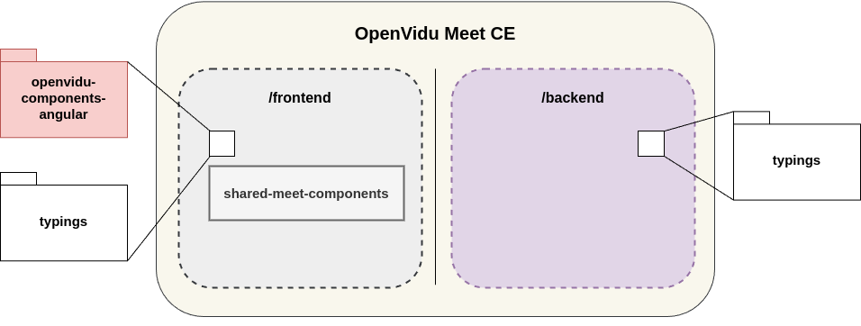

# OpenVidu Meet

OpenVidu Meet is a fully featured, self-hosted video conferencing application built with Angular, Node.js and [LiveKit](https://livekit.io/). It ships as part of an OpenVidu deployment and provides user accounts and login, granular roles and per-room permissions, room management, recordings, analytics and webhooks.

It can also be **embedded** into third-party web applications — either as the `<openvidu-meet>` web component or inside an `<iframe>` — so the host application can build its own business layer on top of the meeting.

This repository contains the **Community Edition (CE)**. The **Professional Edition (PRO)** lives in a separate private repository and extends CE rather than forking it.

# Table of Contents

1. [Architecture Overview](#architecture-overview)
2. [Prerequisites](#prerequisites)
3. [Getting Started](#getting-started)
4. [Development](#development)
    - [Development Mode](#development-mode)
    - [Manual Development Setup](#manual-development-setup)
    - [Environment Configuration](#environment-configuration)
5. [Building](#building)
6. [Testing](#testing)
7. [Documentation](#documentation)
8. [Production Deployment](#production-deployment)
9. [Project Structure](#project-structure)
10. [Using the meet.sh Script](#using-the-meetsh-script)

## Architecture Overview

OpenVidu Meet is a monorepo managed with **pnpm workspaces**:

[](/docs/openvidu-meet-ce-architecture.png)

| Package                                              | Workspace name                     | Role |
| ---------------------------------------------------- | ---------------------------------- | ---- |
| `meet-ce/typings`                                     | `@openvidu-meet/typings`           | TypeScript contracts shared by backend, frontend and embedding API |
| `meet-ce/backend`                                     | `@openvidu-meet/backend`           | Node.js + Express REST API; also serves the built frontend and the web component bundle |
| `meet-ce/frontend`                                    | `@openvidu-meet/frontend`          | Angular application shell |
| `meet-ce/frontend/projects/shared-meet-components`    | `@openvidu-meet/shared-components` | Angular library holding **all** UI logic, organized by domain |
| `meet-ce/frontend/webcomponent`                        | `@openvidu-meet/webcomponent`      | The `<openvidu-meet>` custom element (Angular Elements) |
| `testapp`                                             | `@openvidu-meet/testapp`           | Host application used to validate the web component and iframe integrations |

Two design decisions are worth knowing up front:

- **All application logic lives in the `shared-meet-components` library**, not in the application shell. This lets the PRO edition override or extend components instead of duplicating them.
- **The backend serves everything in production.** The frontend build writes into `meet-ce/backend/public/frontend`, and the web component bundle is deployed into `meet-ce/backend/public/webcomponent`. There is no separate web server.

The REST API is described with OpenAPI 3.1 and split in two: a **public API** (`/api/v1`, documented and backwards-compatible) and an **internal API** (`/internal-api/v1`, consumed by our own frontend, no compatibility promise).

## Prerequisites

- **Node.js** `24.15.0` or later (Angular 22 requires `^22.22.3 || ^24.15.0 || >=26`). CI and the Docker image both pin `24.15.0`.
- **pnpm** — CI and the Docker image pin `11.8.0`; `./meet.sh` offers to install it globally if it is missing.
- **Backing services**: OpenVidu Meet needs **LiveKit**, **MongoDB**, **Redis** and an **S3-compatible object store** (or Azure Blob Storage / Google Cloud Storage). It refuses to start without MongoDB.

The simplest way to get all of them locally is the [OpenVidu local deployment](https://github.com/OpenVidu/openvidu-local-deployment), which is also what CI uses. The default values in [meet-ce/backend/src/environment.ts](meet-ce/backend/src/environment.ts) already match it, so no configuration is needed:

| Service         | Default endpoint         |
| --------------- | ------------------------ |
| LiveKit         | `ws://localhost:7880` (`devkey` / `secret`) |
| MongoDB         | `localhost:27017`        |
| Redis           | `localhost:6379`         |
| S3 (MinIO)      | `http://localhost:9000`  |

> [!TIP]
> When running the OpenVidu local deployment alongside this repository, disable its bundled
> `openvidu-meet` container so your local build is the one being used.

## Getting Started

```bash
# Clone the repository
git clone https://github.com/OpenVidu/openvidu-meet.git
cd openvidu-meet

# Start development mode with hot-reload
./meet.sh dev
```

The application is then available at [http://localhost:6080/meet](http://localhost:6080/meet), and the REST API documentation at [http://localhost:6080/meet/api/v1/docs](http://localhost:6080/meet/api/v1/docs).

Log in with the initial administrator account, `admin` / `admin` (override with `MEET_INITIAL_ADMIN_USER` and `MEET_INITIAL_ADMIN_PASSWORD`).

## Development

### Development Mode

The recommended way to develop is the integrated development mode, which runs all watchers concurrently:

```bash
./meet.sh dev
```

It starts:

- **Typings** — `tsc --watch` over the shared type definitions
- **Shared Meet Components** — the Angular library, watch build
- **Backend** — Node.js server with auto-restart and a parallel type-checker
- **Frontend** — Angular watch build, output written straight into the backend's `public/frontend`
- **REST API docs** — regenerated from the OpenAPI specs on change

Optional flags:

- `--testapp` — also start the testapp UI on `:5080` and the webhook bridge on `:5081`
- `--webcomponent` — also start the web component bundle watcher

> [!IMPORTANT]
> The typings watcher publishes a `dist/typings-ready.flag` that every other watcher waits on, and it
> restarts them whenever the contracts change. If the backend or frontend watcher looks stuck, check
> the typings watcher output first — a type error there blocks the rest by design.

If a `meet-pro/` checkout is present, `./meet.sh dev` first asks whether to run the CE or the PRO edition.

### Manual Development Setup

If you prefer more granular control:

```bash
# Install dependencies
./meet.sh install

# Build shared typings first (required — they emit runtime JavaScript)
./meet.sh build-typings

# In separate terminals:
# Terminal 1 - Backend
cd meet-ce/backend && pnpm run start:dev

# Terminal 2 - Frontend
cd meet-ce/frontend && pnpm run dev

# Terminal 3 - Typings watcher (optional)
cd meet-ce/typings && pnpm run dev
```

### Environment Configuration

The backend loads its environment file based on `NODE_ENV`, relative to `meet-ce/backend/`:

| `NODE_ENV`             | File        |
| ---------------------- | ----------- |
| `development`          | `.env.dev`  |
| `test` / `ci`          | `.env.test` |
| `production`           | process environment only |

Set `MEET_CONFIG_DIR` to point at a custom file instead. Most variables are `MEET_*`-prefixed; the LiveKit ones are not:

```env
LIVEKIT_URL=ws://localhost:7880
LIVEKIT_API_KEY=devkey
LIVEKIT_API_SECRET=secret
```

For the complete list, see [meet-ce/backend/src/environment.ts](meet-ce/backend/src/environment.ts).

## Building

Build all components in the correct order (typings → backend → library → frontend → web component):

```bash
./meet.sh build

# Or build individual components:
./meet.sh build-typings          # shared contracts
./meet.sh build-webcomponent     # web component bundle (deployed into the backend)
./meet.sh build-testapp          # test application
```

### CI/CD Optimized Builds

`meet.sh` accepts flags to skip work already done earlier in a pipeline:

```bash
./meet.sh install
./meet.sh build-typings
./meet.sh build-webcomponent --skip-install --skip-typings
./meet.sh test-unit-webcomponent --skip-install
```

**Available flags:** `--skip-install`, `--skip-build`, `--skip-typings`, `--base-href <path>`.

## Testing

### Unit Tests

These run without any backing services:

```bash
./meet.sh test-unit-backend        # Jest
./meet.sh test-unit-frontend       # Karma + Jasmine (shared-meet-components)
./meet.sh test-unit-webcomponent   # Jest
```

### Linting

Both projects fail on any warning:

```bash
./meet.sh lint-backend
./meet.sh lint-frontend
```

### Integration and End-to-End Tests

```bash
# Backend integration tests (grouped so they can be sharded in CI)
pnpm run test:integration-backend-room-management
pnpm run test:integration-backend-auth-security
pnpm run test:integration-backend-recordings
# ... see package.json for the full list

# Playwright suites
./meet.sh test-e2e-frontend        # SPA + web component projects
./meet.sh test-e2e-webcomponent    # web component project only
```

> [!NOTE]
> Integration and E2E tests exercise real infrastructure (LiveKit, MongoDB, Redis, object storage) and,
> for the embedding suites, a running testapp. They cannot pass against a bare checkout — bring the
> environment up first. Playwright browsers are installed automatically; add `--force-install-browsers`
> to reinstall them or `--skip-install-browsers` to skip that step.

### TestApp

A dedicated application for manually exercising the embedding integrations:

```bash
./meet.sh start-testapp
```

Available at [http://localhost:5080](http://localhost:5080), with the webhook bridge on `:5081`.

## Documentation

```bash
# Embedding API reference (attributes, commands, events)
./meet.sh build-webcomponent-doc [output_dir]

# REST API reference (public + internal)
./meet.sh build-rest-api-doc [output_dir]
```

Output locations:

- **Embedding API**: `docs/webcomponent/{attributes,commands,events}.md`, generated from the documented enums in `meet-ce/typings/src/embedded/`. Passing `output_dir` moves them there instead.
- **REST API**: `meet-ce/backend/public/openapi/public.html` and `internal.html`.

Both are generated artifacts — edit the sources (the typings enums, the YAML under `meet-ce/backend/openapi/`), never the output.

## Production Deployment

### Using Docker

```bash
# Build the image
./meet.sh build-docker openvidu-meet-ce

# Build a demo image (different base href)
./meet.sh build-docker openvidu-meet-ce --demos

# Run it
docker run \
  -e LIVEKIT_URL=<your-livekit-url> \
  -e LIVEKIT_API_KEY=<your-livekit-api-key> \
  -e LIVEKIT_API_SECRET=<your-livekit-api-secret> \
  -p 6080:6080 \
  openvidu-meet-ce
```

The three LiveKit variables are mandatory unless `MEET_CONFIG_DIR` provides a configuration file; the container refuses to start without them. MongoDB, Redis and object storage must also be reachable.

### Manual Production Start

```bash
./meet.sh build
./meet.sh start --prod     # or: ./meet.sh start --ci
```

### Key Environment Variables

| Variable | Purpose |
| -------- | ------- |
| `LIVEKIT_URL`, `LIVEKIT_API_KEY`, `LIVEKIT_API_SECRET` | LiveKit connection (required) |
| `SERVER_PORT` | Backend port (default `6080`) |
| `MEET_BASE_PATH` | Path Meet is mounted under (default `/meet`) |
| `MEET_INITIAL_ADMIN_USER`, `MEET_INITIAL_ADMIN_PASSWORD` | Bootstrap administrator account |
| `MEET_INITIAL_API_KEY` | Bootstrap API key for the public REST API |
| `MEET_MONGO_*`, `MEET_REDIS_*` | Database and Redis connection |
| `MEET_BLOB_STORAGE_MODE` | `s3` (default), `abs` or `gcs`, plus the matching provider variables |
| `NODE_ENV` | `development`, `ci` or `production` |

The full list, with defaults, is in [meet-ce/backend/src/environment.ts](meet-ce/backend/src/environment.ts).

## Project Structure

```
openvidu-meet/
├── meet.sh                             # Main build, development and test script
├── pnpm-workspace.yaml                 # pnpm workspace configuration
├── CLAUDE.md                           # Architecture notes for AI coding agents
│
├── meet-ce/                            # Community Edition
│   ├── typings/                        # Shared TypeScript contracts
│   │   └── src/
│   │       ├── database/               # Domain entities (room, user, recording, ...)
│   │       ├── request/ response/      # REST API shapes
│   │       └── embedded/               # Public embedding API (attributes, commands, events)
│   │
│   ├── backend/
│   │   ├── src/
│   │   │   ├── routes/                 # Route definitions (public + internal)
│   │   │   ├── middlewares/            # Auth, validation, rate limiting, error handling
│   │   │   ├── controllers/            # Thin HTTP layer
│   │   │   ├── services/               # Business logic (incl. storage providers)
│   │   │   ├── repositories/           # MongoDB access
│   │   │   ├── models/                 # Zod + Mongoose schemas, errors, tokens
│   │   │   ├── migrations/             # MongoDB schema migrations
│   │   │   └── environment.ts          # Environment configuration
│   │   ├── openapi/                    # OpenAPI 3.1 specifications
│   │   ├── tests/                      # unit/ and integration/
│   │   └── public/                     # Generated: built frontend + web component bundle
│   │
│   ├── frontend/
│   │   ├── src/                        # Application shell (thin)
│   │   ├── projects/
│   │   │   └── shared-meet-components/ # Angular library — all UI logic, by domain
│   │   │       └── src/lib/
│   │   │           ├── domains/        # auth, console, rooms, room-members, users,
│   │   │           │                   #   recordings, meeting, embedded
│   │   │           └── shared/         # Cross-domain services, guards, models, i18n
│   │   ├── webcomponent/               # <openvidu-meet> custom element
│   │   └── e2e/                        # Playwright specs (SPA)
│   │
│   └── docker/                         # Dockerfile + entrypoint
│
├── testapp/                            # Embedding test application
├── scripts/                            # Dev watchers and doc generators
├── docs/                               # Architecture diagram + generated docs
└── webhooks-snippets/                  # Webhook receiver examples in several languages
```

The `typings`, `backend`, `frontend` and `webcomponent` packages each contain a `CLAUDE.md` documenting their architecture, conventions and pitfalls in more depth. They are written for AI coding agents, but are useful to new contributors too.

## Using the meet.sh Script

`./meet.sh` is the entry point for all development, build and test tasks. Run `./meet.sh help` for the authoritative list.

```bash
# Installation
./meet.sh install                       # Install all dependencies

# Building
./meet.sh build                         # Build all components in order
./meet.sh build-typings                 # Shared contracts only
./meet.sh build-webcomponent            # Web component bundle only
./meet.sh build-testapp                 # Test application

# Development
./meet.sh dev                           # Start all watchers
./meet.sh dev --testapp                 # + testapp (:5080) and webhook bridge (:5081)
./meet.sh dev --webcomponent            # + web component watcher

# Testing and linting
./meet.sh test-unit-backend
./meet.sh test-unit-frontend
./meet.sh test-unit-webcomponent
./meet.sh test-e2e-frontend
./meet.sh test-e2e-webcomponent
./meet.sh lint-backend
./meet.sh lint-frontend

# Running
./meet.sh start --prod                  # Production mode
./meet.sh start --ci                    # CI mode
./meet.sh start-testapp                 # Test application only

# Documentation
./meet.sh build-webcomponent-doc [dir]
./meet.sh build-rest-api-doc [dir]

# Docker
./meet.sh build-docker <image-name> [--demos]

# Professional Edition (requires access to the private repository)
./meet.sh clone-pro
```

### Examples

```bash
# Full development workflow
./meet.sh install
./meet.sh dev

# CI/CD optimized workflow
./meet.sh install
./meet.sh build-typings
./meet.sh build-webcomponent --skip-install --skip-typings
./meet.sh test-unit-webcomponent --skip-install

# Production build and run
./meet.sh build
./meet.sh start --prod
```

## Technologies

- **Frontend**: Angular 22 (standalone, zoneless, signals), Angular Material, TypeScript 6
- **Web Component**: Angular Elements, shadow DOM, lazy-loaded bundle
- **Backend**: Node.js, Express 5, TypeScript 6, InversifyJS, Zod, Mongoose, Winston
- **Data**: MongoDB, Redis, S3 / Azure Blob Storage / Google Cloud Storage
- **WebRTC Infrastructure**: LiveKit
- **Package Manager**: pnpm (workspaces)
- **Build Tools**: Angular CLI, ng-packagr, TypeScript Compiler, esbuild
- **Testing**: Jest (backend and web component unit), Karma + Jasmine (library unit), Playwright (E2E)
- **Documentation**: OpenAPI 3.1 / Redocly, custom generators

## Contributing

Contributions are welcome. Before opening a pull request, please make sure that:

1. Unit tests pass: `./meet.sh test-unit-backend && ./meet.sh test-unit-frontend && ./meet.sh test-unit-webcomponent`
2. Linting is clean: `./meet.sh lint-backend && ./meet.sh lint-frontend`
3. Code is formatted with Prettier (tabs, width 4, print width 120 — see `.prettierrc`)
4. Shared types are declared in `meet-ce/typings/` and documented with TSDoc
5. New or changed endpoints are reflected in the OpenAPI specs under `meet-ce/backend/openapi/`
6. Documentation is updated as needed

## License

Licensed under the Apache License, Version 2.0. See [LICENSE](LICENSE) for details.

## Links

- [OpenVidu Website](https://openvidu.io/)
- [OpenVidu Meet](https://openvidu.io/latest/meet/)

---

For questions and support, visit our [community forum](https://openvidu.discourse.group/).
