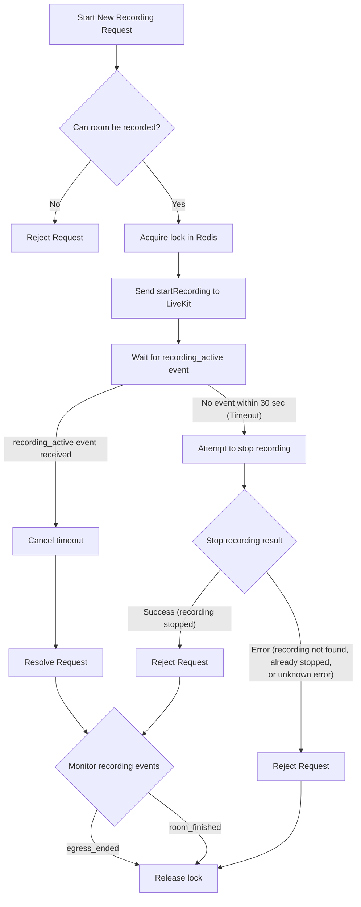
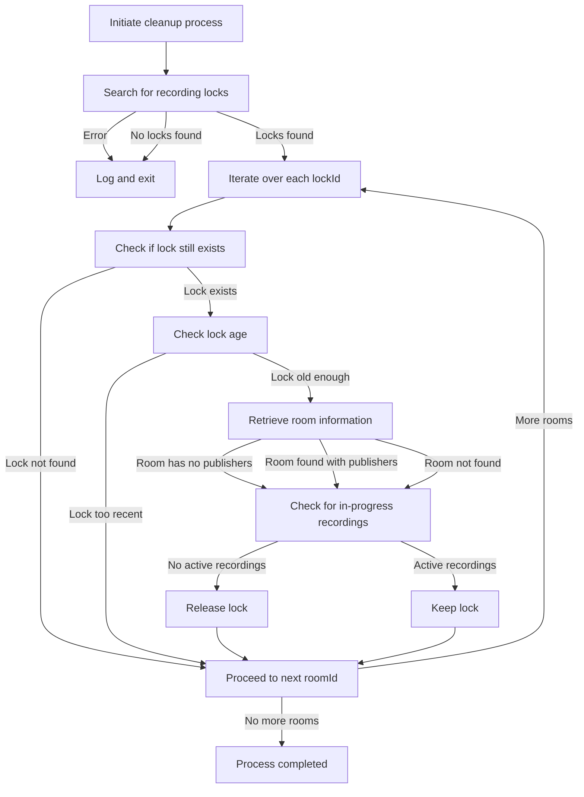
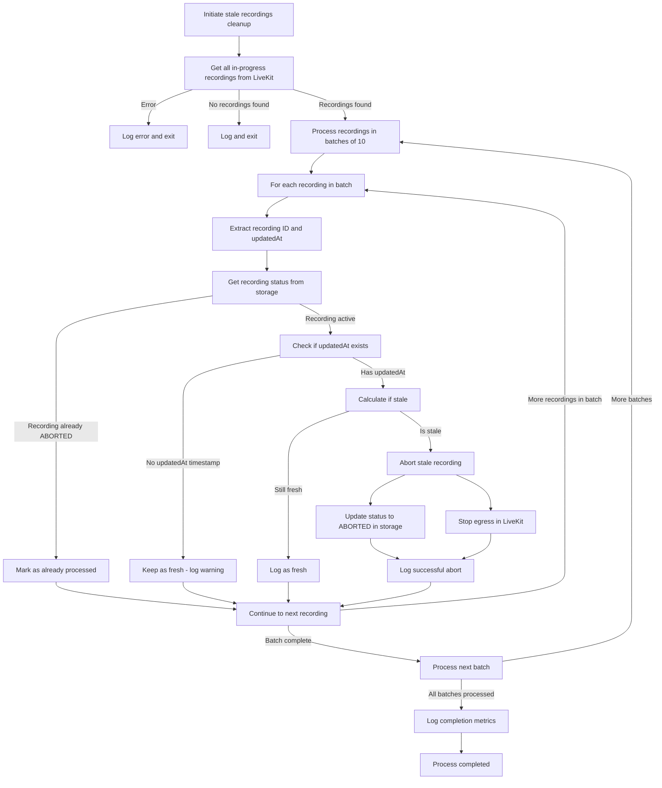

# OpenVidu Meet Backend

This is the backend of OpenVidu Meet. It is a Node.js application that uses [Express](https://expressjs.com/) as web server.

## How to run

For running the backend you need to have installed [Node.js](https://nodejs.org/). Then, you can run the following commands:

```bash
npm install
npm run start:dev
```

This will start the backend in development mode. The server will listen on port 6080.
You can change the port and other default values in the file `src/config.ts`.

## How to build

For building the backend you can run the following command:

```bash
npm install
npm run build:prod
```

## Storage Structure

The OpenVidu Meet backend uses an S3 bucket to store all application data, including rooms, recordings, user information, and system config. The bucket follows a hierarchical structure organized as follows:

### Bucket Structure

```plaintext
openvidu-appdata/
├── openvidu-meet/
│   ├── api-keys.json
│   ├── global-config.json
│   ├── users/
│   │   └── admin.json
│   ├── rooms/
│   │   └── room-123/
│   │       └── room-123.json
│   └── recordings/
│       ├── .metadata/
│       │   └── room-123/
│       │       └── {egressId}/
│       │           └── {uid}.json
│       ├── .secrets/
│       │   └── room-123/
│       │       └── {egressId}/
│       │           └── {uid}.json
│       ├── .room_metadata/
│       │   └── room-123/
│       │       └── room_metadata.json
│       └── room-123/
│           └── room-123--{uid}.mp4
```

### Directory Descriptions

#### **API Keys** (`api-keys.json`)

Stores API keys used for authenticating requests to the OpenVidu Meet API. This file contains a list of valid API keys along with their creation dates.

#### **Global Config** (`global-config.json`)

Contains system-wide settings and configurations for the OpenVidu Meet application, such as security config, webhook config and global rooms appearance.

#### **Users** (`users/`)

Stores user account information in individual JSON files. Each file is named using the username (e.g., `admin.json`) and contains user-specific data including authentication details and roles.

#### **Rooms** (`rooms/`)

Contains room configuration and metadata. Each room is stored in its own directory named after the room ID, containing:

- `room-123.json`: Room configuration, settings, and metadata

#### **Recordings** (`recordings/`)

The recordings directory is organized into several subdirectories to manage different aspects of recorded content:

- **Recording Files** (`room-123/`): Contains the actual video files with naming convention `room-123--{uid}.mp4`

- **Metadata** (`.metadata/room-123/{egressId}/{uid}.json`): Stores recording metadata including:
    - Recording duration and timestamps
    - Participant information
    - Quality settings and technical specifications
    - File size and format details

- **Secrets** (`.secrets/room-123/{egressId}/{uid}.json`): Contains sensitive recording-related data such as:
    - Encryption keys
    - Access tokens
    - Security credentials

- **Room Metadata** (`.room_metadata/room-123/room_metadata.json`): Stores room-level information for recordings including:
    - Room name and description
    - Recording session details
    - Participant list and roles

### Recording Identifier Format

Recordings use a composite identifier format: `recordingId: room-123--{egressId}--{uid}`

Where:

- `room-123`: The room identifier
- `{egressId}`: LiveKit egress process identifier
- `{uid}`: Unique recording session identifier

This naming convention ensures uniqueness and provides traceability between the recording file, its metadata, and the originating room session.

## Recordings

The recording feature is based on the following key concepts:

1. **Single active recording per room**:
   Each room can only have one active recording at a time. When a new recording starts, a lock is acquired to mark that room as actively recording. Any attempt to start another recording for the same room while the lock is active will be rejected.

2. **Lock lifetime**:
   The lock has not lifetime. It is not automatically released after a certain period. Instead, it remains active until the recording is manually stopped and an `egress_ended` webhook is received, or when the room meeting ends. This design choice allows for flexibility in managing recordings, as the lock can be held for an extended duration if needed. However, it also means that care must be taken to ensure that the lock is released appropriately to avoid blocking future recording attempts. (see **Failure handling** below).



4. **Failure handling**:
   If an OpenVidu instance crashes while a recording is active, the lock remains in place. This scenario can block subsequent recording attempts if the lock is not released promptly. To mitigate this issue, a lock garbage collector is implemented to periodically clean up orphaned locks.

    The garbage collector runs when the OpenVidu deployment starts, and then every 30 minutes.



5. **Stale recordings cleanup**:
   To handle recordings that become stale due to network issues, LiveKit or Egress crashes, or other unexpected situations, a separate cleanup process runs every 15 minutes to identify and abort recordings that haven't been updated within a configured threshold (5 minutes by default).


