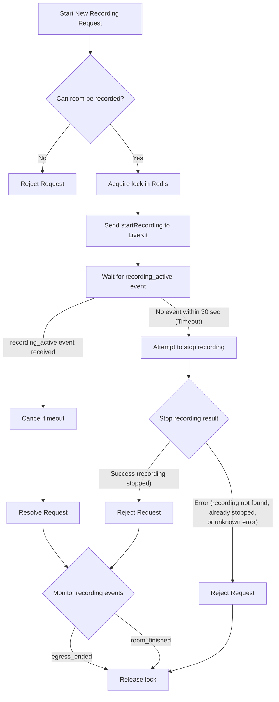
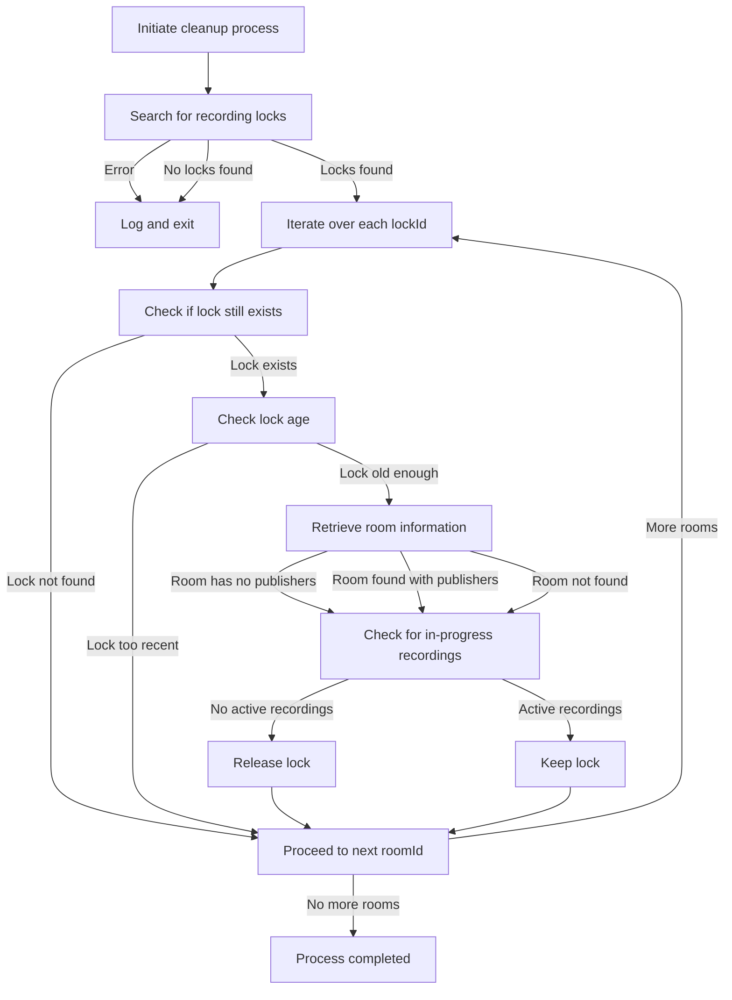

# OpenVidu Meet Backend

This is the backend of OpenVidu Meet. It is a Node.js application that uses [Express](https://expressjs.com/) as web server.

## How to run

For running the backend you need to have installed [Node.js](https://nodejs.org/). Then, you can run the following commands:

```bash
npm install
npm run start:dev
```

This will start the backend in development mode. The server will listen on port 6080.
You can change the port and other default values in the file `src/config.ts`.

## How to build

For building the backend you can run the following command:

```bash
npm install
npm run build:prod
```

## Recordings

The recording feature is based on the following key concepts:

1. **Single active recording per room**:
   Each room can only have one active recording at a time. When a new recording starts, a lock is acquired to mark that room as actively recording. Any attempt to start another recording for the same room while the lock is active will be rejected.

2. **Lock lifetime**:
   The lock has not lifetime. It is not automatically released after a certain period. Instead, it remains active until the recording is manually stopped and an `egress_ended` webhook is received, or when the room meeting ends. This design choice allows for flexibility in managing recordings, as the lock can be held for an extended duration if needed. However, it also means that care must be taken to ensure that the lock is released appropriately to avoid blocking future recording attempts. (see **Failure handling** below).




4. **Failure handling**:
   If an OpenVidu instance crashes while a recording is active, the lock remains in place. This scenario can block subsequent recording attempts if the lock is not released promptly. To mitigate this issue, a lock garbage collector is implemented to periodically clean up orphaned locks.

    The garbage collector runs when the OpenVidu deployment starts, and then every 30 minutes.



### Storage structure for recordings

Recordings are stored in the `openvidu-meet/recordings` s3 directory, inside of openvidu bucket.

Each recording is stored in a directory named after the room where it was recorded. Inside this directory, there is a `.metadata` directory that contains the metadata of the recording, and a directory for each egressId that contains the recording files.

```plaintext
openvidu/
├── openvidu-meet/
│   ├── rooms/
│   │   └── room-123/
│   │       └── room-123.json
│   └── recordings/
│       ├── .metadata/
│       │   └── room-123/
│       │       └── {egressId}/
│       │           └── {uid}.json
│       └── room-123/
│           └── room-123--{uid}.mp4
```

**Recording Identifier Format:**

The recording identifier is a unique string that combines the room ID, egress ID, and user ID. It follows the format:
`recordingId: room-123--{egressId}--{uid}`
