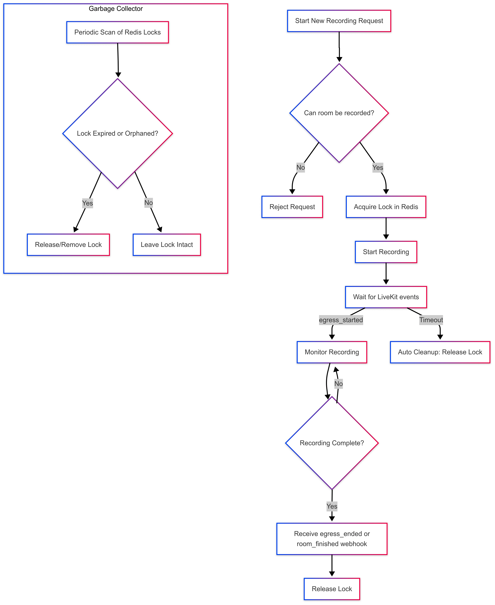

# OpenVidu Meet Backend

This is the backend of OpenVidu Meet. It is a Node.js application that uses [Express](https://expressjs.com/) as web server.

## How to run

For running the backend you need to have installed [Node.js](https://nodejs.org/). Then, you can run the following commands:

```bash
npm install
npm run start:dev
```

This will start the backend in development mode. The server will listen on port 6080.
You can change the port and other default values in the file `src/config.ts`.

## How to build

For building the backend you can run the following command:

```bash
npm install
npm run build:prod
```

## Recordings

The recording feature is based on the following key concepts:

1. **Single active recording per room**:
   Each room can only have one active recording at a time. When a new recording starts, a lock is acquired to mark that room as actively recording. Any attempt to start another recording for the same room while the lock is active will be rejected.

2. **Lock lifetime**:
   The lock has a default lifetime of six hours. It will be automatically released either when the recording is manually stopped and an `egress_ended` webhook is received, or when the room meeting ends.

3. **Distributed lock storage**:
   The lock is stored in Redis, enabling all instances to share and access the same lock state. This ensures that any instance — not just the one that initiated the recording — can release the lock, helping to prevent desynchronization issues and orphaned locks.

4. **Failure handling**:
   If an OpenVidu instance crashes while an OpenVidu Meet recording is active, the lock remains in place until its lifetime expires. This scenario can block subsequent recording attempts if the lock is not released promptly. To mitigate this issue, a lock garbage collector is implemented to periodically clean up orphaned locks.

   The garbage collector runs every XX minutes and performs the following checks for each lock:
   - **Room Existence:** Verifies if the room associated with the lock still exists.
   - **Recording Status:** Uses LiveKit SDK to determine if there is an active recording for that room.

   If the room does not exist or no active recording is detected, the lock is considered orphaned and is immediately released. This strategy helps ensure that stale locks do not prevent new recordings and maintains overall system reliability.


[](../docs/meet-recording-diagram.png)


### Storage structure for recordings

Recordings are stored in the `openvidu-meet/recordings` s3 directory, inside of openvidu bucket.

Each recording is stored in a directory named after the room where it was recorded. Inside this directory, there is a `.metadata` directory that contains the metadata of the recording, and a directory for each egressId that contains the recording files.


```plaintext
openvidu/
├── openvidu-meet/
│   ├── rooms/
│   │   └── room-123/
│   │       └── room-123.json
│   └── recordings/
│       ├── .metadata/
│       │   └── room-123/
│       │       └── {egressId}/
│       │           └── {uid}.json
│       └── room-123/
│           └── room-123--{uid}.mp4
```

**Recording Identifier Format:**
`recordingId: room-123--{egressId}--{uid}`
