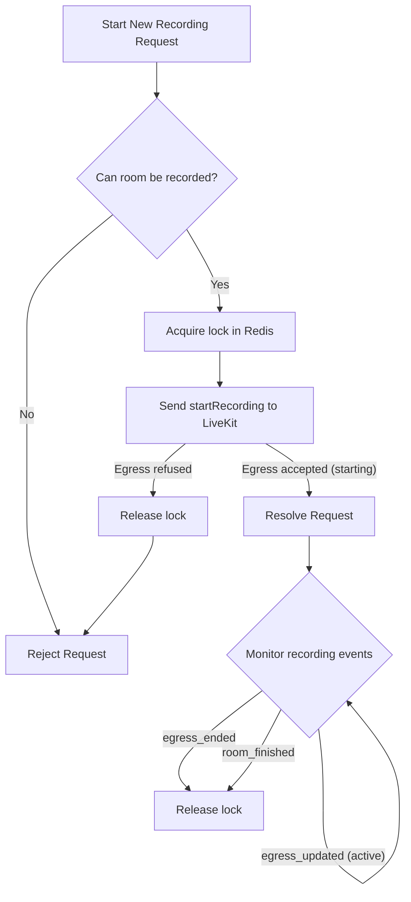
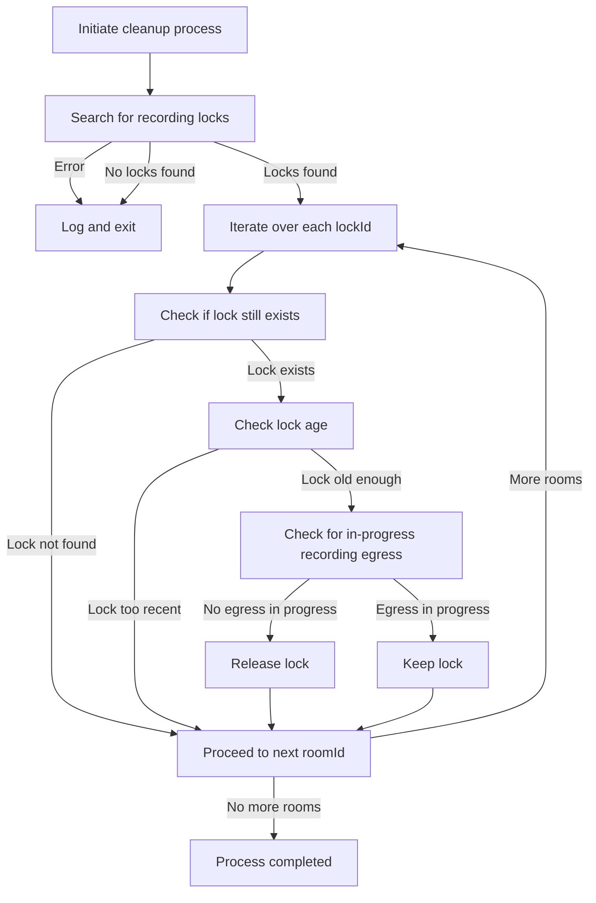
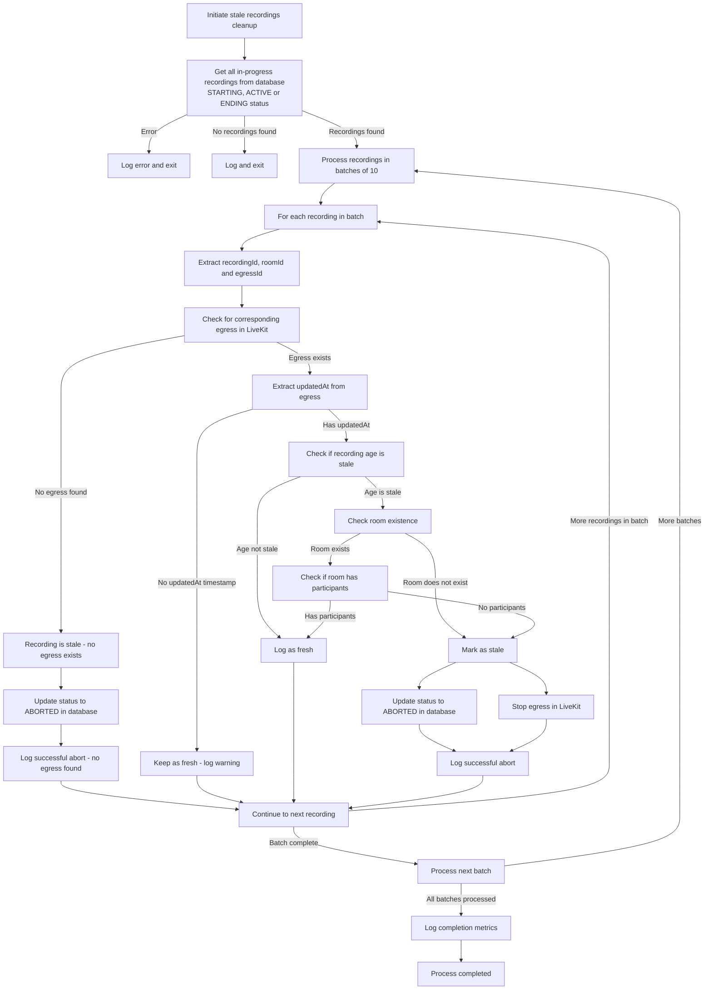

# OpenVidu Meet Backend

This is the backend of OpenVidu Meet. It is a Node.js application that uses [Express](https://expressjs.com/) as web server.

## How to run

For running the backend you need to have installed [Node.js](https://nodejs.org/). Then, you can run the following commands:

```bash
pnpm install
pnpm run start:dev
```

This will start the backend in development mode. The server will listen on port 6080.
You can change the port and other default values in the file `src/config.ts`.

## How to build

For building the backend you can run the following command:

```bash
pnpm install
pnpm run build:prod
```

## Storage Architecture

The OpenVidu Meet backend uses **MongoDB** as its primary data storage system for all application data, including rooms, recordings, user information, API keys, and system configuration.

### MongoDB Collections

The application manages the following MongoDB collections:

- **`meetglobalconfigs`**: System-wide configuration (singleton collection)
- **`meetusers`**: User accounts with authentication and roles
- **`meetapikeys`**: API keys for authentication
- **`meetrooms`**: Room configurations and metadata
- **`meetrecordings`**: Recording metadata and access information
- **`meetmigrations`**: Migration tracking for data and schema migrations

Each document in these collections includes a `schemaVersion` field for schema evolution tracking (internal use only, not exposed via API).

### Legacy Storage (S3/ABS/GCS)

Prior versions of OpenVidu Meet used cloud object storage (S3, Azure Blob Storage, or Google Cloud Storage) for data persistence. The legacy storage structure followed this organization:

### Bucket Structure

```plaintext
openvidu-appdata/
├── openvidu-meet/
│   ├── api-keys.json
│   ├── global-config.json
│   ├── users/
│   │   └── admin.json
│   ├── rooms/
│   │   └── room-123/
│   │       └── room-123.json
│   └── recordings/
│       ├── .metadata/
│       │   └── room-123/
│       │       └── {egressId}/
│       │           └── {uid}.json
│       ├── .secrets/
│       │   └── room-123/
│       │       └── {egressId}/
│       │           └── {uid}.json
│       ├── .room_metadata/
│       │   └── room-123/
│       │       └── room_metadata.json
│       └── room-123/
│           └── room-123--{uid}.mp4
```

### Directory Descriptions

#### **API Keys** (`api-keys.json`)

Stores API keys used for authenticating requests to the OpenVidu Meet API. This file contains a list of valid API keys along with their creation dates.

#### **Global Config** (`global-config.json`)

Contains system-wide settings and configurations for the OpenVidu Meet application, such as security config, webhook config and global rooms appearance.

#### **Users** (`users/`)

Stores user account information in individual JSON files. Each file is named using the username (e.g., `admin.json`) and contains user-specific data including authentication details and roles.

#### **Rooms** (`rooms/`)

Contains room configuration and metadata. Each room is stored in its own directory named after the room ID, containing:

- `room-123.json`: Room configuration, settings, and metadata

#### **Recordings** (`recordings/`)

The recordings directory is organized into several subdirectories to manage different aspects of recorded content:

- **Recording Files** (`room-123/`): Contains the actual video files with naming convention `room-123--{uid}.mp4`

- **Metadata** (`.metadata/room-123/{egressId}/{uid}.json`): Stores recording metadata including:
    - Recording duration and timestamps
    - Participant information
    - Quality settings and technical specifications
    - File size and format details

- **Secrets** (`.secrets/room-123/{egressId}/{uid}.json`): Contains sensitive recording-related data such as:
    - Encryption keys
    - Access tokens
    - Security credentials

- **Room Metadata** (`.room_metadata/room-123/room_metadata.json`): Stores room-level information for recordings including:
    - Room name and description
    - Recording session details
    - Participant list and roles

### Recording Identifier Format

Recordings use a composite identifier format: `recordingId: room-123--{egressId}--{uid}`

Where:

- `room-123`: The room identifier
- `{egressId}`: LiveKit egress process identifier
- `{uid}`: Unique recording session identifier

This naming convention ensures uniqueness and provides traceability between the recording file, its metadata, and the originating room session.

---

## Data Migration System

OpenVidu Meet includes a comprehensive migration system to handle data persistence changes and schema evolution.

### Legacy Storage to MongoDB Migration

On first startup, the application automatically migrates existing data from legacy storage (S3/Azure Blob Storage/Google Cloud Storage) to MongoDB. This migration:

- **Runs automatically** on application startup if legacy storage is configured
- **Is idempotent** - safe to run multiple times (skips already migrated data)
- **Preserves all data** - rooms, recordings, users, API keys, and global config
- **Tracks progress** in the `meetmigrations` collection
- **Is HA-safe** using distributed locks to prevent concurrent migrations

### MongoDB Schema Migration System

The application uses a schema versioning system to safely evolve MongoDB document structures over time. This system:

- **Runs automatically** at startup before accepting requests
- **Tracks schema versions** via the `schemaVersion` field in each document
- **Supports forward-only migrations** (v1 → v2 → v3)
- **Processes in batches** for efficiency with large collections
- **Is HA-safe** using distributed locks
- **Validates before execution** to ensure migration safety

Schema migrations handle scenarios like:

- Adding new required fields with default values
- Removing deprecated fields
- Renaming or restructuring fields
- Data type transformations

For detailed information about creating and managing schema migrations, see:
📖 **[Schema Migration Documentation](./src/migrations/README.md)**

---

## Recordings

The recording feature is based on the following key concepts:

1. **Single active recording per room**:
   Each room can only have one active recording at a time. When a new recording starts, a lock is acquired to mark that room as actively recording. Any attempt to start another recording for the same room while the lock is active will be rejected.

2. **Lock lifetime**:
   The lock has no lifetime of its own. It is held until the recording's `egress_ended` webhook arrives or the room meeting ends, however long the recording runs. The start request itself does not wait for the recording to be recording: it completes as soon as LiveKit accepts the egress, which is returned in the `starting` status and turns `active` when the first published track reaches it. A room where nobody publishes keeps it `starting`, and LiveKit reports the outcome either way (`egress_updated` when it activates, `egress_ended` when it fails or the room closes), so OpenVidu Meet never decides on its own that a recording failed to start.



3. **Failure handling**:
   If an OpenVidu instance crashes while a recording is active, or the `egress_ended` webhook is lost, the lock remains in place. This scenario can block subsequent recording attempts if the lock is not released promptly. To mitigate this issue, a lock garbage collector is implemented to periodically clean up orphaned locks: a lock older than a grace period whose room has no recording egress in progress in LiveKit is released. An in-progress egress keeps the lock whatever the room looks like, since an egress waiting for its first track has no publishers yet and LiveKit ends every egress of a room that closes.

    The garbage collector runs when the OpenVidu deployment starts, and then every 15 minutes.



4. **Stale recordings cleanup**:
   To handle recordings that become stale due to network issues, LiveKit or Egress crashes, or other unexpected situations, a separate cleanup process runs every 14 minutes to identify and abort recordings that haven't been updated within a configured threshold (5 minutes by default). A recording still waiting for its first track is only aborted once its room is gone or empty: with participants in the room it is legitimately waiting for someone to publish.


